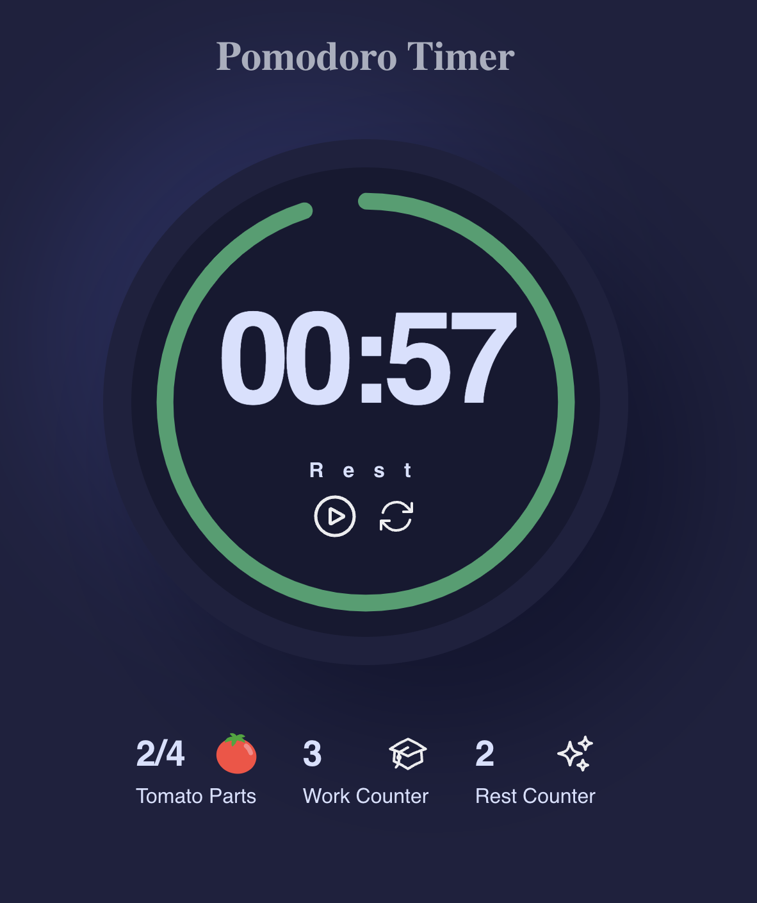

# Pomodoro Timer
The Pomodoro Technique is a time management method in which you do focused work during 25-minute intervals — known as pomodoros — and take a five-minute break. This method claims to:

- Improve focus
- Minimize distractions
- Prevent burnout
- Promote accountability
- Boost motivation

Which is why perfectionists and procrastinators will find it useful. It’s easier to commit to 25 minutes of work at a time than a whole afternoon of non-stop work.


## About the project
This application should allow a user to start a 25-minute work timer, which, upon completion,
triggers a 5-minute break timer automatically. This cycle should be repeatable.
Additionally, users should have the ability to reset the current timer at any stage.

## Preview


## Core Features
- [x] Timer Display: Clearly show the remaining time in minutes and seconds.
- [x] Start/Pause Button: Allow the user to start or pause the timer. When the timer is running, the button text should change to "Pause", and vice versa.
- [x] Reset Button: Enable the user to stop the timer (if running) and reset it to the initial state.
- [x] Automatic Break: After the 25-minute work timer completes, a 5-minute break timer should automatically start. Indicate to the user whether the timer is in work or break mode.
- [x] Cycle Counter: Display the number of complete work/break cycles.

## How to start
- either use bun or yarn, depending on choice of package manager
- if using bun and not installed, install it first:
```bash
curl https://bun.sh/install | bash
bun install
bun dev
```
- if using yarn
```bash
yarn install
yarn dev
```
open http://localhost:5173/ or http://localhost:3000 (if you've used --port 3000) to use the app


## Choice of technology

### Folder/Project Structure
Based loosely off https://github.com/alan2207/bulletproof-react

### Framework
- We're going with ReactJS since we don't need any SSR capabilities

### UI Library
- UI library will be using chakra-UI

### Routing
- No Routing needed since it's a simple app with only 1 feature
- For the heck of it, since we're using pure react, we'll be integrating react-router-dom

### Persistence
- We don't really need persistence, but I'm going to add in a feature where users can come back to see how many sessions they've had so far over the lifetime of using the app
rather than just over the lifetime of the session, adding another "gamification" layer where it feels like they have progressed more.
- For that purpose, I'll use `Zustand`, which allows a `persist` layer to store in `localstorage` along with the ability to have a global context for future use.


===========================

## Prompts used:
- Timer:
```
write a function in typescript for a function in react that tracks the state of a minute and second timer and reduces the timer by 1 second in intervals of 1 second
```

- Generated:
```typescript
import { useState, useEffect } from 'react';

interface TimerProps {
  initialMinutes: number;
  initialSeconds: number;
}

const useTimer = ({ initialMinutes, initialSeconds }: TimerProps) => {
  const [minutes, setMinutes] = useState(initialMinutes);
  const [seconds, setSeconds] = useState(initialSeconds);

  useEffect(() => {
    const intervalId = setInterval(() => {
      if (seconds === 0) {
        if (minutes === 0) {
          clearInterval(intervalId);
          // Handle timer completion (e.g., call a function)
        } else {
          setMinutes(minutes - 1);
          setSeconds(59);
        }
      } else {
        setSeconds(seconds - 1);
      }
    }, 1000);

    return () => clearInterval(intervalId);
  }, [minutes, seconds]); // Cleanup function to clear interval on unmount

  const formattedTime = `${minutes.toString().padStart(2, '0')}:${seconds.toString().padStart(2, '0')}`;

  return { formattedTime };
};

export default useTimer;
```

- Css keyframes, wasn't quite sure how to start
```
create a pulse animation using css
```
- response
```css
@keyframes pulse {
  from { transform: scale(1); }
  to { transform: scale(1.05); }
}
```